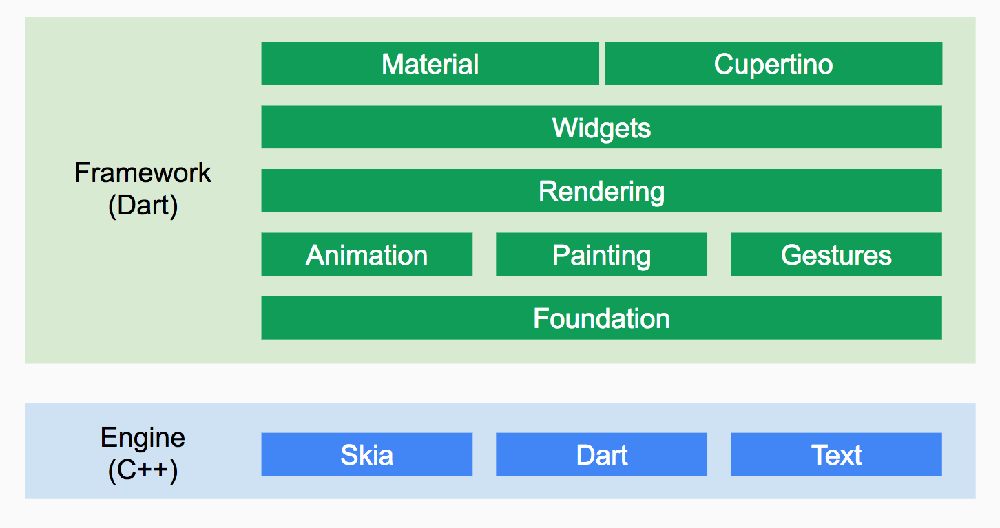

# Arquitetura

Entender a arquitetura do Flutter é importante, precisamos entender todo a "anatomia" dos nossos aplicativos.



Código Dart do aplicativo, códigos específicos de cada plataforma \(caso haja\), os packages e plugins do projeto \(que também são códigos Dart e/ou específicos\), imagens, fontes e qualquer outro ativo do projeto.



O framework em si. 



O motor responsável por unir o seu código e o do framework e fazer a compilação para arm/x86 \(intruções binárias\).

Utiliza a biblioteca [Skia](https://skia.org) e o mesmo processador de textos do Google Chrome.



Responsável por delegar e controlar as instruções binárias ao hardware.



Não precisa de explicação né ?!




Ao gerar a versão final de um aplicativo, o código Dart é compilado para arm/x86 e executado diretamente pelo hardware e isto é o que garante a alta performance.


## Flutter framework:

Se colocarmos uma lupa nas camadas azul escuro e verde da imagem anterior, teremos os seguintes detalhes:


A camada azul anterior, na imagem abaixo é representada pela verde. 

A camada verde anterior, na imagem abaixo é representada pela azul.


O framework sem si, é construído sobre a Engine \(C++\) e é puramente código Dart. Podemos acessar cada uma das classes e ver como um botão ou o switch é implementado.

