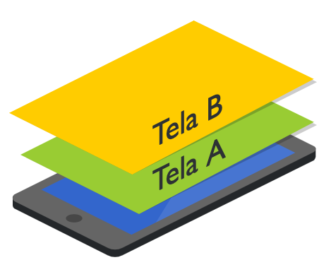
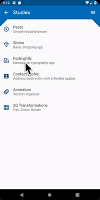
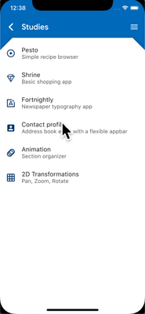

# Navegação

A navegação no Flutter utiliza o conceito de "pilha" \(stack\). Ou seja, se estamos na **Tela A** e vamos para a **Tela B**, internamente, estamos colocando a **Tela B** acima da **Tela A**. Assim, a **Tela B** está no "topo" da pilha. Se desejarmos voltar à **Tela A**, basta remover a **Tela B** do topo da pilha.



Para manipular a "pilha" de telas no Flutter, utilizamos o widget [Navigator](https://api.flutter.dev/flutter/widgets/Navigator-class.html). Utilizando o conceito de **push** e **pop**, adicionamos e removemos telas da nossa "pilha" de navegação.


\*\*\*\*[**Push**](https://api.flutter.dev/flutter/widgets/Navigator/push.html): Em tradução literal, estamos "empurrando" uma nova tela ao topo da pilha.

\*\*\*\*[**Pop**](https://api.flutter.dev/flutter/widgets/Navigator/pop.html): A tela que está no topo da pilha, é removida.


Agora já sabemos os conceitos básicos de navegação no Flutter, vamos ver no código, como eles são implementados:


A transição entre telas é diferente no iOS e no Android. Sabendo disso, o Flutter se adapta "automagicamente" à cada plataforma e proporciona o efeito e transição padrão em cada uma delas.






Push: Neste exemplo, estamos navegando para a **NovaPagina**.

```dart
  Navigator.push(context, MaterialPageRoute(builder: (BuildContext context) => NovaPagina()));
```

Mesmo utilizando um widget **MaterialPageRoute** \(que segue as especificações do Material Desing e é utilizada no Android\), se este código for executado em um dispositivo iOS, o efeito da transição será aquele característico da plataforma.

Pop: Quando estivermos em **NovaPagina** e quisermos voltar à página anterior, basta chamar o método **pop\(\)**.

```dart
Navigator.pop(context);
```

Simples, certo? Ao navegar para uma próxima tela, utilizamos o `push` e para voltar, o `pop`.

