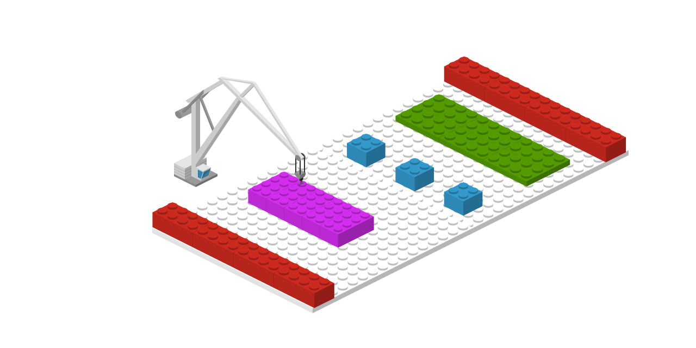

# Widgets

Todo aplicativo Flutter é um widget. Composto de outra centenas de widgets. Portanto, entende-los é mais do que a nossa obrigação. Uma coisa bacana, é que na própria documentação do Flutter, eles deixam claro que a inspiração para os widgets vieram do [React](https://pt-br.reactjs.org/). Assim como no framework do Facebook, todo aplicativo é baseado em componentes, no Flutter é baseado em widgets. 

> _**"A ideia central é que você construa sua interface com widgets"**_

Com esta afirmação, retirada da documentação, acredito que dá para entender, efetivamente, o que é um widget. 


Pense no aplicativo como um LEGO, onde cada pequeno widget representa uma peça e ao final, várias peças compõem um brinquedo. 

No Flutter, vários widgets são combinados para compor um aplicativo.


Existem apenas 2 tipos de widgets: [Stateless ](https://api.flutter.dev/flutter/widgets/StatelessWidget-class.html)e [Stateful](https://api.flutter.dev/flutter/widgets/StatefulWidget-class.html). Iremos abordar esta diferença na próxima seção.

Podemos classificar os widgets em 2 grupos principais: **Layout** e **UI \(user interface\)**.


Certamente temos outros widgets que não se enquadram perfeitamente em nenhum destes grupos, mas para começar, fica fácil com essa divisão para  identificar quando e quais widgets utilizar para construir uma interface.


Widgets de **layout**, são aqueles que se preocupam apenas em posicionar outros widgets. Alguns dos principais: 

* [Column](https://api.flutter.dev/flutter/widgets/Column-class.html)
* [Row](https://api.flutter.dev/flutter/widgets/Row-class.html)
* [Scaffold](https://api.flutter.dev/flutter/material/Scaffold-class.html)
* [Stack](https://api.flutter.dev/flutter/widgets/Stack-class.html)

Widgets de **interface**, são aqueles que efetivamente estão visíveis ao usuário, como:

* [Text](https://api.flutter.dev/flutter/widgets/Text-class.html)
* [RaisedButton](https://api.flutter.dev/flutter/material/RaisedButton-class.html)
* [Switch](https://api.flutter.dev/flutter/material/Switch-class.html)


No [catálogo](https://flutter.dev/docs/development/ui/widgets), temos mais de 170 widgets documentados \(vale a pena dar uma conferida\). 


Precisamos dar destaque para 2 conjuntos de widgets amplamente utilizados e que já abordei na seção Visão Geral, o primeiro e mais popular é o [Material](https://flutter.dev/docs/development/ui/widgets/material) package, que segue as definições de layout do Material Design e o [Cupertino](https://flutter.dev/docs/development/ui/widgets/cupertino) package, seguindo as definições de design do iOS.

Ambos pacotes nos fornecem widgets _**ready-to-use**_**,** bastando importá-los no nosso projeto e utilizar. O time do Flutter é responsável pela construção e manutenção de cada um deles. Caso tenham mudanças ou novos componentes para as plataformas, será questão de tempo até serem implementados pelo Flutter.

Nada nos impede de criarmos um app com a "cara" do iOS para Android e vice-versa. Também não significa que nosso aplicativo sempre terá uma aparência _ios-style_ ou _android-style_, muito pelo contrário. Flutter nos proporciona níveis incríveis de personalização.

#### Fonte:

[https://flutter.dev/docs/development/ui/widgets-intro](https://flutter.dev/docs/development/ui/widgets-intro)

