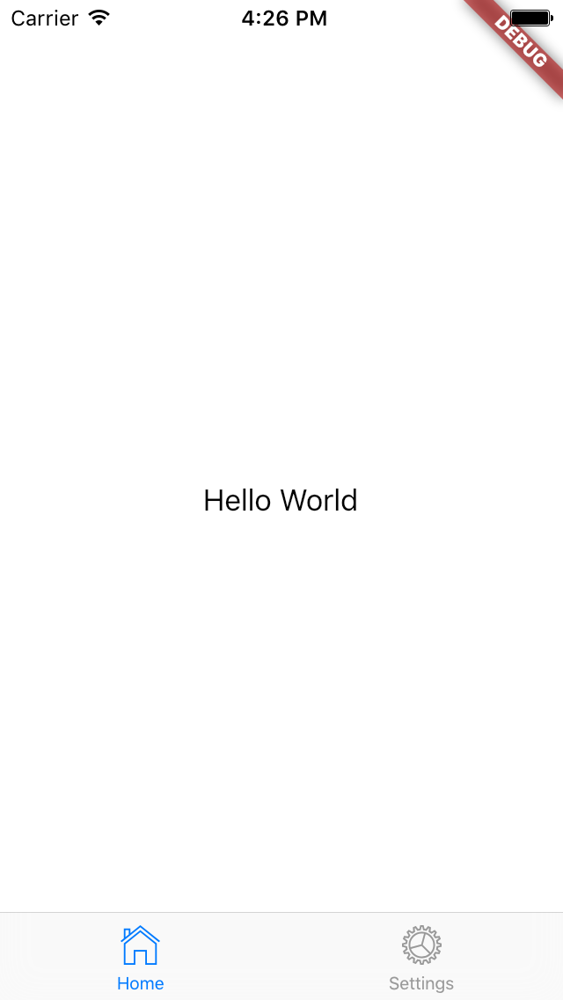

# Cupertino

Na biblioteca [Cupertino](https://api.flutter.dev/flutter/cupertino/cupertino-library.html) temos o duas opções de widget para estruturar a tela do aplicativo;

[CupertinoPageScaffold](https://api.flutter.dev/flutter/cupertino/CupertinoPageScaffold-class.html): Onde temos uma barra de navegação no topo \(onde utilizamos uma [CupertinoNavigationBar](https://api.flutter.dev/flutter/cupertino/CupertinoNavigationBar-class.html) e o restante da tela é com o conteúdo.

[CupertinoTabScaffold](https://api.flutter.dev/flutter/cupertino/CupertinoTabScaffold-class.html): Similar ao widget anterior, porém além da barra de navegação superior, este fornece um layout que possui uma barra de navegação inferior, onde utilizando uma [CupertinoTabBar](https://api.flutter.dev/flutter/cupertino/CupertinoTabBar-class.html) e [CupertinoTabView](https://api.flutter.dev/flutter/cupertino/CupertinoTabView-class.html). 

Outros componentes característicos de um aplicativo iOS nativo também estão disponíveis, como: 

[CupertinoActionSheet](https://api.flutter.dev/flutter/cupertino/CupertinoActionSheet-class.html): Quando precisarmos oferecer opções de escolha para alguma ação.

[CupertinoSegmentedControl](https://api.flutter.dev/flutter/cupertino/CupertinoSegmentedControl-class.html): Utilizado para navegação por abas.

[CupertinoPicker](https://api.flutter.dev/flutter/cupertino/CupertinoPicker-class.html), [CupertinoDatePicker](https://api.flutter.dev/flutter/cupertino/CupertinoDatePicker-class.html) e [CupertinoTimerPicker](https://api.flutter.dev/flutter/cupertino/CupertinoTimerPicker-class.html): Para facilitar a entrada de dados pelo usuário.

Veja o código de um aplicativo combinando alguns destes widgets:

```dart
import 'package:flutter/cupertino.dart';

void main() => runApp(MeuCupertinoApp());

class MeuCupertinoApp extends StatelessWidget {
  @override
  Widget build(BuildContext context) {
    return CupertinoApp(
      title: 'Cupertino App',
      home: CupertinoTabScaffold(
        tabBar: CupertinoTabBar(items: [
          BottomNavigationBarItem(
              icon: Icon(CupertinoIcons.home), title: Text('Home')),
          BottomNavigationBarItem(
              icon: Icon(CupertinoIcons.settings), title: Text('Settings')),
        ]),
        tabBuilder: (context, index) {
          return Center(child: Text('Hello World'));
        },
      ),
    );
  }
}

```



Neste [vídeo](https://www.youtube.com/watch?v=3PdUaidHc-E), os widget da biblioteca [Cupertino](https://api.flutter.dev/flutter/cupertino/cupertino-library.html) são apresentados com maiores detalhes.

