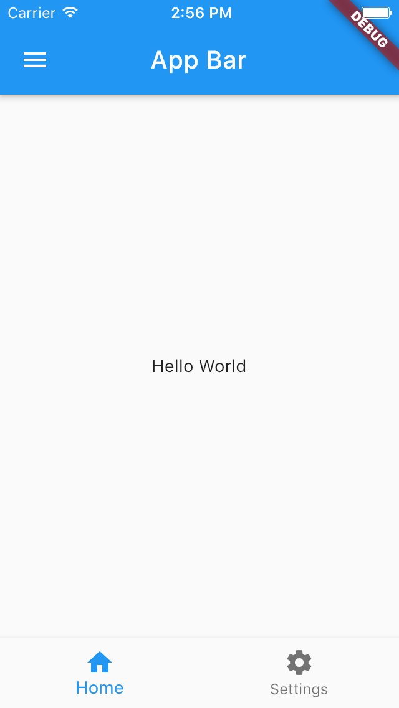

# Material

No [catálogo](https://flutter.dev/docs/development/ui/widgets/material) de widgets do Flutter, atualmente conta com quase 40 widgets prontos para uso. Desde um simples [botão](https://api.flutter.dev/flutter/material/RaisedButton-class.html) até widgets para estruturar todo o aplicativo, como o [Scaffold](https://api.flutter.dev/flutter/material/Scaffold-class.html).

Navegando pelo catálogo, é possível identificar o que cada widget representa, porém listarei aqui os principais:

[MaterialApp](https://api.flutter.dev/flutter/material/MaterialApp-class.html): Fornece uma estrutura completa para um aplicativo. Todas as rotas, opções de tema podem ser configuradas. Bem como a tela inicial. Ele será o widget raiz de um aplicativo. 

[Scaffold](https://api.flutter.dev/flutter/material/Scaffold-class.html): Para estruturar o layout de  uma tela, este é o widget ideal. Neste podemos adicionar barras de navegação \(superior e inferior\),  e na propriedade **body**, definimos o principal widget da nossa tela.

[BottomNavigationBar](https://api.flutter.dev/flutter/material/BottomNavigationBar-class.html): Barra de navegação inferior, onde podemos adicionar ícones e textos das nossas telas.

[AppBar](https://api.flutter.dev/flutter/material/AppBar-class.html): Barra superior, onde podemos colocar o título da nossa tela. O Flutter também utiliza este widget para exibir o ícone 

[Drawer](https://api.flutter.dev/flutter/material/Drawer-class.html): Menu lateral, que se abre após clicarmos em um ícone na [AppBar](https://api.flutter.dev/flutter/material/AppBar-class.html). Ao adicionarmos um [Drawer](https://api.flutter.dev/flutter/material/Drawer-class.html) ao [Scaffold](https://api.flutter.dev/flutter/material/Scaffold-class.html) e não adicionarmos uma [AppBar](https://api.flutter.dev/flutter/material/AppBar-class.html), o ícone para abrir o [Drawer](https://api.flutter.dev/flutter/material/Drawer-class.html) não é exibido.

Veja o código de um aplicativo combinando todos estes widgets:

```dart
import 'package:flutter/material.dart';

void main() => runApp(MeuMaterialApp());

class MeuMaterialApp extends StatelessWidget {
  @override
  Widget build(BuildContext context) {
    return MaterialApp(
      home: Scaffold(
        appBar: AppBar(
          title: Text('App Bar'),
        ),
        drawer: Drawer(),
        body: Center(
          child: Container(
            child: Text('Hello World'),
          ),
        ),
        bottomNavigationBar: BottomNavigationBar(
          items: [
            BottomNavigationBarItem(
              icon: Icon(Icons.home),
              title: Text('Home'),
            ),
            BottomNavigationBarItem(
              icon: Icon(Icons.settings),
              title: Text('Settings'),
            )
          ],
        ),
      ),
    );
  }
}

```





Neste [vídeo](https://www.youtube.com/watch?v=DL0Ix1lnC4w), há uma demonstração de como utilizar os widgets da biblioteca [Material](https://api.flutter.dev/flutter/material/material-library.html) para construir um aplicativo com pouco mais de 100 linhas de código.


Utilizando os widgets da biblioteca [Material](https://api.flutter.dev/flutter/material/material-library.html), nossa interface ficara muito parecida com um aplicativo Android nativo. E isso pode não ser agradável aos usuários do iOS. Felizmente, o Flutter possui um conjunto de widgets para que imitam o design de aplicativos nativos de iOS: a biblioteca [Cupertino](https://api.flutter.dev/flutter/cupertino/cupertino-library.html).


